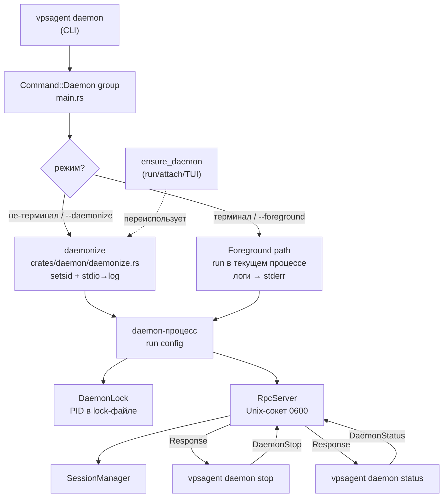

# План: Само-демонизация vpsagent daemon

**Дата:** 2026-08-03
**Статус:** Планирование
**Приоритет:** P1
**Спецификация:** [docs/specs/2026-08-03-daemon-self-daemonize.md](../specs/2026-08-03-daemon-self-daemonize.md)

## Цель

Научить `vpsagent daemon` самостоятельно отсоединяться от терминала и переживать
отключение SSH (без внешних обёрток), добавить CLI-команды `stop`/`status` для
управления жизненным циклом через Unix-сокет.

## Текущее состояние

Анализ кодовой базы (Rust workspace, edition 2021, tokio + clap + tracing):

- **`crates/daemon/src/lib.rs`** — `run(config)` блокирует, обрабатывает SIGINT/SIGTERM
  (`tokio::signal::unix`), вызывает `manager.shutdown_all()` + чистит сокет. **Не
  делает fork/setsid, не отсоединяется от терминала.** Точка входа для изменений.
- **`crates/vpsagent/src/main.rs`**
  - `Command::Daemon` (~строка 24) — `enum Command::Daemon` без аргументов; вызов
    `vpsagent_daemon::run(config)` напрямую (~строка 77).
  - `ensure_daemon()` (~250–293) — **уже** поднимает демона в фоне через
    `tokio::process::Command` + `pre_exec(setsid)` + `Stdio::null()`, polls сокет
    до 5 сек. Референс паттерна daemonize; будет переиспользован (FR-010).
  - `libc_setsid()` (~296) — FFI `setsid(2)`, уже есть.
- **`crates/daemon/src/lock.rs`** — `DaemonLock`: атомарная публикация PID через
  hard link в `{socket}.lock`, проверка живости через `kill(pid, 0)`, удаление в
  `Drop`. `pub fn pid(&self) -> u32` — есть. **PID-файл уже существует** — отдельный
  `--pid-file` не вводится (FR-005).
- **`crates/core/src/protocol.rs`** — `Request` enum: `DaemonStatus` (строка 21),
  `DaemonRestart` (строка 73, заглушка). **`DaemonStop` — отсутствует** (FR-006).
- **`crates/core/src/types.rs:128`** — `DaemonStatus { version, pid, uptime_secs,
  sessions, agents }` — готово для `status`.
- **`crates/daemon/src/server.rs:159`** — обработчик `Request::DaemonStatus`
  собирает uptime/sessions через `manager.list_sessions()`.
- **`crates/core/src/config.rs:60`** — `Paths { data_dir, socket, db, sessions_dir }`.
  **`log_file` — отсутствует** (FR-003, добавляется).
- **`crates/daemon/src/session_manager.rs:376`** — `pub async fn shutdown_all(&self)`
  — готов, переиспользуется для `DaemonStop`.
- **Зависимости:** `libc` и `signal-hook` уже в `Cargo.lock` (транзитивно); `clap`,
  `tokio` (с `signal::unix`), `tokio-util` (CancellationToken) — в workspace.
  Прямых зависимостей `signal-hook`/`libc` в `crates/daemon/Cargo.toml` нет —
  добавляются минимально.

## Архитектура решения



**Поток daemonize (Unix):**
1. `vpsagent daemon` (CLI) определяет режим (FR-002): `is_terminal(stdin)` →
   foreground; иначе daemonize (или `--daemonize` форсирует, `--foreground`
   отменяет).
2. В режиме daemonize: `vpsagent_daemon::daemonize(log_file)` делает
   `setsid()` + `freopen` stdio в лог-файл (`/dev/null` для stdin), возвращает
   управление в **текущий** процесс (один процесс, не fork — см. «Решение»
   ниже про модель).
3. Управляющий процесс печатает pid/сокет/лог (FR-004), завершается с code 0.
4. `run(config)` стартует в отсоединённом процессе: lock → storage → RPC →
   shutdown-цикл (SIGINT/SIGTERM/SIGHUP).

**Модель «один процесс + setsid» вместо double-fork.** Классический double-fork
избыточен для tokio-приложения: мы не открываем слушающие сокеты до fork, а
`setsid()` достаточно, чтобы оторваться от управляющего терминала и пережить
SIGHUP от закрытия SSH. `ensure_daemon` уже использует ровно этот подход
(`pre_exec(setsid)` + `Stdio::null()`), и он работает. План следует
**существующему проверенному паттерну** проекта, а не вводит double-fork.

## Решение

### Слой 1 — Протокол и конфиг (`crates/core`)

#### Файлы:
- [ ] `crates/core/src/protocol.rs` — добавить `Request::DaemonStop`.
- [ ] `crates/core/src/config.rs` — добавить `log_file: PathBuf` в `Paths`,
      default `data_dir.join("daemon.log")`; обновить `Default` impl.

#### API / Команды / Endpoints:

| Запрос (Request) | Вход | Выход | Описание |
|------------------|------|-------|----------|
| `DaemonStop` | — | `Response::Ok` | Запрос graceful shutdown через сокет |
| `DaemonStatus` (сущ.) | — | `Response::DaemonStatus` | Существующий, для `status` |

#### Структуры данных (псевдокод):

```pseudo
// protocol.rs — добавить вариант
enum Request {
    DaemonStatus,        // существует
    // ...
    DaemonRestart,       // существует, заглушка
    DaemonStop,          // НОВЫЙ — graceful shutdown через сокет
}

// config.rs — расширить Paths
struct Paths {
    data_dir: PathBuf,     // существует
    socket: PathBuf,       // существует
    db: PathBuf,           // существует
    sessions_dir: PathBuf, // существует
    log_file: PathBuf,     // НОВЫЙ — default: data_dir.join("daemon.log")
}
```

#### Схема данных:
Миграция не нужна — `Paths` десериализуется из TOML; добавляемое поле получает
`#[serde(default)]` с дефолтом через `Default` impl, старые конфиги совместимы.

### Слой 2 — Демон: daemonize + обработка DaemonStop (`crates/daemon`)

#### Файлы:
- [ ] `crates/daemon/src/daemonize.rs` — **новый модуль**: Unix-only
  само-демонизация (setsid + перенаправление stdio в лог-файл). Не-fork модель.
  На не-Unix — заглушка `pub fn daemonize(...) -> Result<()> { Ok(()) }` (FR-008).
- [ ] `crates/daemon/src/lib.rs` — `pub mod daemonize;` экспорт; `run()` —
  регистрация SIGHUP (FR-011) в shutdown-`tokio::select!`.
- [ ] `crates/daemon/src/server.rs` — обработчик `Request::DaemonStop`:
  запустить graceful shutdown (тот же путь, что SIGTERM) и ответить `Ok` до
  закрытия соединения (FR-006).
- [ ] `crates/daemon/src/shutdown.rs` — **новый** (если потребуется) — общий
  сигнал «остановиться» через `CancellationToken`, переиспользуемый из SIGTERM и
  DaemonStop. Или обойтись `tokio::sync::oneshot`/`Notify` в `lib.rs` —
  решить при реализации.
- [ ] `crates/daemon/Cargo.toml` — добавить `signal-hook` как прямую зависимость
  (для SIGHUP-игнорирования, если `tokio::signal::unix` недостаточно).

#### Команды:

| Команда (внутр.) | Вход | Выход | Описание |
|------------------|------|-------|----------|
| `daemonize(log_file)` | `&Path` | `Result<()>` | setsid + stdio→log, Unix-only |
| `Request::DaemonStop` (RPC) | — | `Ok` | graceful shutdown через сокет |

#### Структуры данных (псевдокод):

```pseudo
// daemonize.rs (Unix)
fn daemonize(log_file: &Path) -> Result<()> {
    // 1. setsid() — новая сессия, отрыв от управляющего терминала
    // 2. freopen stdin  → /dev/null
    // 3. freopen stdout → log_file (append)
    // 4. freopen stderr → log_file (append)
    // 5. chdir("/") — опционально (открытый вопрос спеки)
    // 6. игнорировать SIGHUP (signal-hook) — FR-011
    Ok(())
}

// lib.rs — расширить shutdown-цикл run()
async fn run(config) -> Result<()> {
    // ... lock, storage, manager, server (как сейчас) ...
    #[cfg(unix)]
    let shutdown = async {
        tokio::select! {
            _ = tokio::signal::ctrl_c() => {},
            _ = term.recv() => {},                  // SIGTERM (существующее)
            _ = hup.recv() => { /* SIGHUP — игнорируем, FR-011 */ },
            _ = stop_rx.recv() => {},               // НОВОЕ: сигнал от DaemonStop
        }
    };
    // ... graceful shutdown (как сейчас) ...
}

// server.rs — обработчик DaemonStop
Request::DaemonStop => {
    // 1. ответить Response::Ok (до закрытия)
    // 2. инициировать stop_rx → trigger graceful shutdown
    Response::Ok
}
```

### Слой 3 — CLI: группа `vpsagent daemon` (`crates/vpsagent`)

#### Файлы:
- [ ] `crates/vpsagent/src/main.rs` — `Command::Daemon` → группа clap с
  подкомандами `stop`/`status` + режим запуска (без подкоманды) с флагами
  `--foreground`/`--daemonize`/`--log-file` (FR-007).
- [ ] `crates/vpsagent/src/main.rs` — новые async-функции `daemon_stop(config)`
  и `daemon_status(config)`: подключение к сокету через `RpcClient`,
  `Request::DaemonStop`/`DaemonStatus`, форматирование вывода (FR-012 —
  `--output-format json` для status).
- [ ] `crates/vpsagent/src/main.rs` — путь запуска: определение режима
  (`is_terminal(stdin)` / флаги), вызов `daemonize` перед `run` (или
  переиспользование `ensure_daemon`-паттерна для прямого запуска — см. ниже
  «Решение по модели запуска»).

#### Компонентная структура (CLI):

```pseudo
Command::Daemon  →  enum DaemonCmd
  ├── Run {                  // `vpsagent daemon` без подкоманды
  │     foreground: bool,    //   --foreground
  │     daemonize: bool,     //   --daemonize
  │     log_file: Option<PathBuf>,  // --log-file
  │   }
  ├── Stop                   // `vpsagent daemon stop`
  └── Status {               // `vpsagent daemon status`
        output_format: OutputFormat,  // --output-format text|json
      }
```

#### Решение по модели запуска (прямого `vpsagent daemon`):

Два варианта, выбрать при реализации:

- **Вариант A (inline-setsid):** `vpsagent daemon` сам делает `setsid()` в
  текущем процессе через `daemonize.rs`, stdout/stderr родителя остаются в
  терминале для подтверждения (FR-004), затем stdio перенаправляется в лог.
  Проще, но смешивает «печать подтверждения» и «отсоединение» в одном процессе.

- **Вариант B (re-exec как в ensure_daemon):** `vpsagent daemon` при daemonize
  делает `fork`/re-exec себя с маркером `--daemonize --__daemon-child` (или
  переменной окружения), родитель ждёт появления сокета, печатает pid/лог,
  завершается; child уже отсоединён и зовёт `run`. Ближе к существующему
  `ensure_daemon`, но `ensure_daemon` re-exec'ает из клиента, а тут
  self-re-exec. Чуть сложнее, но чище разделение «управляющий/демон».

**Рекомендация:** Вариант A для первой реализации (минимум кода, matches спеку),
 documented-как-референс `ensure_daemon`. Если выяснится, что смешивание stdio
 мешает — перейти на Вариант B.

## Фазы реализации

### Фаза 1: Протокол + конфиг (оценка: 0.5 ч)
- [x] 1.1 → `crates/core/src/protocol.rs` — добавить `Request::DaemonStop` в enum
- [x] 1.2 → `crates/core/src/config.rs` — добавить `log_file: PathBuf` в `Paths`,
      `#[serde(default)]`, обновить `Default` impl (default `data_dir/daemon.log`)
- [x] 1.3 → проверить `cargo check -p vpsagent-core` (бэквард-совместимость с
      существующими конфигами — без `log_file`)

### Фаза 2: Демон — daemonize + DaemonStop (оценка: 2.5 ч)
- [ ] 2.1 → `crates/daemon/src/daemonize.rs` — новый модуль: `pub fn
      daemonize(log_file: &Path) -> Result<()>`, Unix-only (`#[cfg(unix)]` тело);
      не-Unix заглушка `Ok(())`. setsid + freopen stdio + chdir? + SIGHUP-ignore.
- [ ] 2.2 → `crates/daemon/src/lib.rs` — `pub mod daemonize;`; расширить
      shutdown-`select!` в `run()`: добавить SIGHUP (игнор) и внутренний канал
      `stop_rx` (oneshot/Notify) от обработчика `DaemonStop`.
- [ ] 2.3 → `crates/daemon/src/server.rs` — обработчик `Request::DaemonStop`:
      ответить `Ok`, инициировать `stop_rx` (graceful shutdown). Убедиться, что
      `Ok` уходит **до** shutdown-цикла (клиент получает подтверждение).
- [ ] 2.4 → `crates/daemon/Cargo.toml` — добавить `signal-hook = "0.3"` (если
      `tokio::signal::unix` не покрывает SIGHUP-игнорирование).
- [ ] 2.5 → `cargo build -p vpsagent-daemon` — компилируется на Unix; smoke:
      `vpsagent daemon --foreground` (Ctrl+C → clean shutdown), затем
      `DaemonStop` через клиент.

### Фаза 3: CLI — группа `vpsagent daemon` (оценка: 2 ч)
- [ ] 3.1 → `crates/vpsagent/src/main.rs` — `Command::Daemon` → clap-группа с
      подкомандами `stop`/`status` и режимом запуска (без подкоманды) с флагами
      `--foreground`/`--daemonize`/`--log-file <path>`.
- [ ] 3.2 → `crates/vpsagent/src/main.rs` — `daemon_status(config, format)`:
      `RpcClient::connect` → `Request::DaemonStatus` → вывод (text/json).
      При ошибке подключения — «демон не запущен», exit code 1.
- [ ] 3.3 → `crates/vpsagent/src/main.rs` — `daemon_stop(config)`: `RpcClient`
      → `Request::DaemonStop` → ждать подтверждения, «демон остановлен».
      При ошибке — «демон не запущен», exit code 1.
- [ ] 3.4 → `crates/vpsagent/src/main.rs` — путь запуска: `is_terminal(stdin)` /
      флаги → foreground или `daemonize()` перед `run()`. Вариант A (inline).
      FR-008: на не-Unix — foreground + warning в лог.
- [ ] 3.5 → `cargo build -p vpsagent` — компилируется; `vpsagent daemon --help`
      показывает подкоманды.

### Фаза 4: Рефакторинг ensure_daemon + smoke (оценка: 1 ч)
- [ ] 4.1 → `crates/vpsagent/src/main.rs` — `ensure_daemon()` переиспользует
      общий код daemonize (FR-010): вынести общий хелпер (например,
      `spawn_detached_daemon(exe, config, log_file)`) и использовать из
      `ensure_daemon` и (если Вариант B) из прямого запуска.
- [ ] 4.2 → smoke-тест: `vpsagent run "задача"` (авто-подъём демона) работает
      без регрессий.

### Фаза 5: Тестирование и полировка (оценка: 1.5 ч)
- [ ] 5.1 → Unit/интеграционные тесты:
  - [ ] `protocol.rs` — serde round-trip `Request::DaemonStop`.
  - [ ] `config.rs` — default `log_file` = `data_dir/daemon.log`; старый конфиг
        (без `log_file`) десериализуется.
  - [ ] (опционально) интеграционный тест `daemon stop`/`status` через сокет.
- [ ] 5.2 → Ручное тестирование по сценариям спеки (на yttri-win WSL или сервере):
  - [ ] Сценарий 1: `vpsagent daemon` (pipe) → закрыть «SSH» → процесс жив.
  - [ ] Сценарий 2: `vpsagent daemon --foreground` → Ctrl+C → clean shutdown.
  - [ ] Сценарий 3: `vpsagent daemon status` / `vpsagent daemon stop`.
  - [ ] Повторный запуск при живом демоне — отказ.
- [ ] 5.3 → Платформенная проверка: `cargo check` на macOS (foreground-only
      path компилируется, warning логируется). Windows-сборка — если доступна.
- [ ] 5.4 → Сборка `x86_64-unknown-linux-musl` на yttri-win, smoke-тест
      daemonize в musl (старт → имитация закрытия SSH → `ps`/`ss` проверка).
- [ ] 5.5 → `cargo clippy --workspace` без новых предупреждений; `cargo fmt --check`.

## Трейсабельность: Требования → Задачи

| Требование | Фаза | Задачи |
|------------|------|--------|
| FR-001 (daemonize по умолчанию на Linux) | 2, 3 | 2.1, 3.4 |
| FR-002 (auto-detect терминала / флаги) | 3 | 3.4 |
| FR-003 (log_file в config, --log-file) | 1, 3 | 1.2, 3.1 |
| FR-004 (печать pid/сокет/лог, exit 0) | 3 | 3.4 |
| FR-005 (переиспользовать DaemonLock как PID-файл) | 2 | 2.2 (без изменений lock) |
| FR-006 (Request::DaemonStop, graceful shutdown) | 1, 2 | 1.1, 2.3 |
| FR-007 (группа `vpsagent daemon` + stop/status) | 3 | 3.1, 3.2, 3.3 |
| FR-008 (Unix-only daemonize, не-Unix foreground+warning) | 2, 3 | 2.1, 3.4 |
| FR-010 (ensure_daemon переиспользует код) | 4 | 4.1 |
| FR-011 (игнор SIGHUP) | 2 | 2.1, 2.2 |
| FR-012 (status --output-format json) | 3 | 3.2 |
| FR-020 (restart, P2) | — | отложено (вне фаз) |
| FR-021 (ротация логов, P2) | — | отложено (вне фаз) |

## Риски и митигации

| Риск | Вероятность | Влияние | Митигация |
|------|-------------|---------|-----------|
| Inline-setsid (Вариант A) смешивает печать подтверждения и отсоединение stdio — подтверждение не успевает уйти в терминал | Средняя | Среднее | Печатать подтверждение **до** перенаправления stdio; при проблеме — Вариант B (re-exec) |
| `tokio::signal::unix` не позволяет «игнорировать» SIGHUP (только ловить) — нужен `signal-hook` | Низкая | Низкое | Уже добавляем `signal-hook` в 2.4; FFI `signal(SIGHUP, SIG_IGN)` как fallback |
| SIGHUP всё же приходит и убивает демон до установки обработчика (гонка при старте) | Низкая | Высокое | Устанавливать обработчик SIGHUP **первым** в `run()`, до любых других действий |
| `DaemonStop` отвечает `Ok`, но сокет закрывается раньше, чем ответ доходит до клиента | Средняя | Среднее | Шлём `Ok`, даём `tokio::time::sleep` 50–100мс, затем инициируем shutdown |
| musl: `setsid`/`freopen` ведут себя иначе, чем glibc | Низкая | Среднее | Smoke-тест в musl (5.4); musl поддерживает POSIX setsid/freopen |
| Добавление `log_file` в `Paths` ломает существующие конфиги | Низкая | Низкое | `#[serde(default)]` + Default impl — старые конфиги совместимы |
| `ensure_daemon` регрессирует после рефакторинга (FR-010) | Средняя | Высокое | Smoke-тест 4.2; если риск высокий — оставить `ensure_daemon` как есть, FR-010 в P1 |

## Зависимости

### Пакеты / Библиотеки
- `signal-hook = "0.3"` — добавить в `crates/daemon/Cargo.toml` (для SIGHUP-игнора,
  если `tokio::signal::unix` недостаточен). Уже транзитивно в `Cargo.lock`.
- `libc` — прямая зависимость (если нужен FFI `setsid`/`signal`); уже транзитивно
  в `Cargo.lock`. FFI-обёртка `libc_setsid` уже есть в `main.rs` — вынести в
  `daemonize.rs`.
- Новых внешних крейтов не требуется — все возможности есть в std/tokio.

### Связанные задачи
- Зависит от: существующего `DaemonLock`, `SessionManager::shutdown_all`,
  `RpcClient` — все готовы.
- Блокирует: будущий `vpsagent daemon restart` (FR-020) — будет построен поверх.

## Открытые вопросы

- [ ] `chdir("/")` при daemonize — классический шаг, но `ensure_daemon` не делает.
      Решить: добавить (безопаснее — не держит cwd) или пропустить (совместимость
      с текущим поведением)? Спека оставляет открытым.
- [ ] `--log-file` спец-значения `stderr`/`stdout` для контейнеров? Пока —
      обычный путь файла; спец-значения отложить.
- [ ] `vpsagent daemon status` — только счётчик сессий (текущий `DaemonStatus`)
      или краткий список? Пока счётчик; расширение — отдельная задача.
- [ ] Вариант A (inline-setsid) vs Вариант B (self-re-exec) — финализировать
      при реализации Фазы 3. Рекомендация: A, переход на B при проблемах.
- [ ] TASKS.md / task-tracker отсутствуют — регистрация плана в трекере
      пропущена (нет инфраструктуры). При желании — завести TASKS.md отдельно.