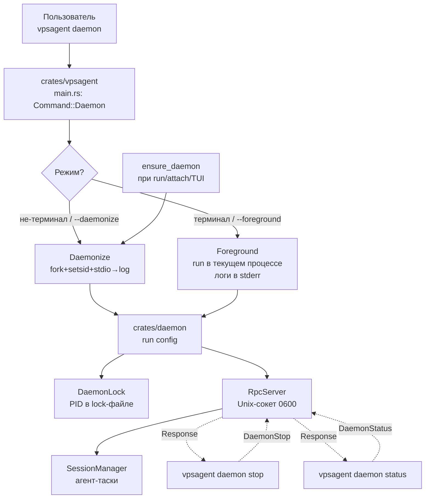

# Спецификация: Само-демонизация vpsagent daemon

**Дата:** 2026-08-03
**Приоритет:** P1
**Тип:** Расширение существующей функциональности

## 1. Проблема

По брифу проекта (`BRIEF.md`, решение №2) `vpsagent` — daemon-first система:
агент живёт на VPS, пользователь подключается по SSH, **отключается — агенты
продолжают работать** (модель tmux/Zellij как референс на саму идею «переживает
отключение»).

Сейчас `vpsagent daemon` (`crates/daemon/src/lib.rs:run`) запускается в
**foreground и блокирует**. При закрытии SSH-сессии ядро шлёт SIGHUP на
управляющую группу, и демон **погибает вместе со всеми работающими агентами**.
Чтобы он выжил, пользователю приходится вручную оборачивать запуск внешними
средствами (`setsid`, `tmux`, `systemd`) — это нарушает канон проекта: демон
**сам** должен формировать для себя среду, переживающую отключение SSH.

Частично проблема уже закрыта функцией `ensure_daemon` в бинаре
(`crates/vpsagent/src/main.rs`): при запуске клиента (`run`/`attach`/TUI/`mcp-serve`)
демон поднимается в фоне через `setsid` + `Stdio::null()`. Но **прямой запуск
`vpsagent daemon`** идёт в foreground и этого пути не проходит. Нужна единая,
согласованная модель само-демонизации, которую использует и прямой запуск, и
авто-подъём из клиента.

Дополнительно: нет удобного способа **остановить** демон (`pkill -TERM -x
vpsagent` — не дружелюбно) и **узнать его статус** извне (команда `status`
существует в протоколе, но не выведена в CLI как отдельная подкоманда демона).

## 2. Цель

После реализации `vpsagent daemon` сам отсоединяется от управляющего терминала и
переживает отключение SSH — без внешних обёрток. Параллельно появляются CLI-команды
`vpsagent daemon stop` и `vpsagent daemon status` для управления жизненным циклом
через тот же Unix-сокет. Запуск остаётся простым: `vpsagent daemon` — и демон работает.

## 3. Текущее состояние

Затрагиваемые модули и конкретные места:

- **`crates/vpsagent/src/main.rs`**
  - `Command::Daemon` (строка ~24) — подкоманда без аргументов; вызов уходит в
    `vpsagent_daemon::run(config)` напрямую (строка ~77), без какой-либо
    обработки режима foreground/daemonize.
  - `ensure_daemon()` (строки ~250–293) — **уже** поднимает демона в фоне через
    `tokio::process::Command` + `pre_exec(setsid)` + `Stdio::null()`, с polls-ожиданием
    сокета до 5 сек. Этот паттерн — референс для само-демонизации и переиспользуется.
  - `libc_setsid()` (~296) — FFI-обёртка над `setsid(2)`, уже есть.
- **`crates/daemon/src/lib.rs`** — `run(config)` блокирует, обрабатывает
  SIGINT/SIGTERM (graceful shutdown), но не делает fork/setsid, не перенаправляет
  stdio в лог, не отсоединляется от терминала.
- **`crates/daemon/src/lock.rs`** — `DaemonLock` уже хранит PID в файле
  `{socket_path}.lock` (атомарная публикация через hard link), проверяет жив ли
  процесс через `kill(pid, 0)`, удаляет файл при `Drop`. PID-файл **уже есть** —
  отдельный `--pid-file` не требуется, достаточно переиспользовать lock-файл.
- **`crates/core/src/protocol.rs`**
  - `Request::DaemonStatus` (строка 21) — есть.
  - `Request::DaemonRestart` (строка 73) — есть, но заглушка (D4, Фаза 8).
  - **`Request::DaemonStop` — отсутствует**, нужна.
- **`crates/core/src/types.rs:128`** — `DaemonStatus { version, pid, uptime_secs,
  sessions, agents }` — структура для `status` уже есть.
- **`crates/daemon/src/server.rs:159`** — обработчик `Request::DaemonStatus`
  уже собирает uptime/sessions; можно переиспользовать для `vpsagent daemon status`.
- **`crates/core/src/config.rs:60`** — `Paths { data_dir, socket, db,
  sessions_dir }`. Отдельного поля под лог-файл нет — нужно добавить `log_file`
  или выводить путь из `data_dir`.

Платформенные соображения: `setsid(2)`, `fork(2)`, `daemon(3)` — Unix-only.
Windows/macOS-разработка не должна ломаться (см. FR-014).

## 4. Пользовательские сценарии

### Сценарий 1: Прямой запуск демона на VPS
**Как** пользователь, **я хочу** запустить `vpsagent daemon` на сервере по SSH
и отключиться, **чтобы** демон и работающие агенты продолжили работать после
закрытия терминала.

**Шаги:**
1. Пользователь: `ssh server`, затем `vpsagent daemon`.
2. Система: определяет, что stdin — не терминал (или пользователь явно не указал
   `--foreground`) → отсоединяется от терминала (новая сессия, stdio → лог-файл),
   пишет PID в lock-файл, выводит в исходный терминал короткое подтверждение
   («демон запущен, pid=…, лог: …») и завершает управляющий процесс.
3. Пользователь: закрывает SSH.
4. Демон: продолжает работать, слушает Unix-сокет, агенты выполняют задачи.

**Критерии приёмки:**
- [ ] После `vpsagent daemon` и закрытия SSH процесс `vpsagent` остаётся в `ps`
      и продолжает слушать сокет.
- [ ] PID в lock-файле совпадает с реальным pid процесса-демона.
- [ ] Логи пишутся в файл внутри data_dir; путь сообщается при запуске.
- [ ] Повторный `vpsagent daemon` отказывается стартовать («демон уже запущен,
      pid=…») и не плодит второй процесс.

### Сценарий 2: Запуск в foreground (отладка)
**Как** разработчик, **я хочу** запустить `vpsagent daemon --foreground`, **чтобы**
видеть логи в терминале и прерывать по Ctrl+C при отладке.

**Шаги:**
1. Пользователь: `vpsagent daemon --foreground`.
2. Система: запускается в foreground, логи в stderr, обрабатывает SIGINT/SIGTERM
   (существующий graceful shutdown).
3. Пользователь: Ctrl+C → демон корректно останавливается, сокет и lock удаляются.

**Критерии приёмки:**
- [ ] `--foreground` отключает daemonize независимо от типа stdin.
- [ ] Ctrl+C → graceful shutdown (тот же путь, что сейчас по SIGTERM).
- [ ] Логи идут в stderr, не в файл.

### Сценарий 3: Остановка и статус извне
**Как** пользователь, **я хочу** выполнить `vpsagent daemon stop` и
`vpsagent daemon status`, **чтобы** управлять демоном без `pkill` и `ps`.

**Шаги:**
1. Пользователь: `vpsagent daemon status` → система подключается к сокету,
   шлёт `DaemonStatus`, выводит version/pid/uptime/кол-во сессий и агентов.
   Если демон не запущен — понятное сообщение «демон не запущен».
2. Пользователь: `vpsagent daemon stop` → система шлёт `DaemonStop`, демон
   выполняет тот же graceful shutdown, что и по SIGTERM, отвечает Ok, клиент
   подтверждает остановку.

**Критерии приёмки:**
- [ ] `status` показывает version, pid, uptime, sessions, agents.
- [ ] `status` при незапущенном демоне — корректное сообщение, exit code ≠ 0.
- [ ] `stop` инициирует graceful shutdown: агенты отменяются, сокет/lock чистятся.
- [ ] `stop` при незапущенном демоне — понятное сообщение, exit code ≠ 0.

## 5. Функциональные требования

### Must Have (P0)
- **FR-001**: `vpsagent daemon` по умолчанию отсоединяется от терминала на Unix
  (Linux): nova сессия (setsid), stdio перенаправляется в лог-файл внутри
  `data_dir`, процесс уходит в фон. Управляющий (исходный) процесс завершается
  после подтверждения, что демон стартовал.
- **FR-002**: Режим определяется автоматически: если stdin — терминал и не указан
  `--daemonize`, запуск идёт в **foreground** (удобно и безопасно при ручном
  запуске); если stdin — не терминал (pipe/redirect/SSH without TTY) ИЛИ указан
  `--daemonize` — демонизируемся. `--foreground` форсирует foreground в любом случае.
- **FR-003**: Путь к лог-файлу определяется из `config.paths` (по умолчанию
  `<data_dir>/daemon.log`); `--log-file <path>` переопределяет. Логи демона
  (tracing) пишутся туда после отсоединения; до отсоединения — в stderr, чтобы
  ошибки старта видел пользователь.
- **FR-004**: При успешном daemonize управляющий процесс печатает в stdout
  краткое подтверждение: pid, путь к сокету, путь к логу — и завершается с code 0.
- **FR-005**: Существующий singleton-lock (`DaemonLock`, файл `{socket}.lock`)
  переиспользуется как PID-файл — отдельный `--pid-file` не вводится. Повторный
  запуск при живом демоне отказывается стартовать с осмысленным сообщением.
- **FR-006**: Добавить `Request::DaemonStop` в протокол (`crates/core/src/protocol.rs`).
  Сервер (`crates/daemon/src/server.rs`) обрабатывает его как запрос graceful
  shutdown: отменяет всех агентов (`manager.shutdown_all()`), закрывает сокет,
  удаляет lock-файл, процесс завершается с code 0. Ответ `Response::Ok` шлётся
  **до** закрытия соединения.
- **FR-007**: Подкоманда `vpsagent daemon` расширяется до группы:
  - `vpsagent daemon` (без подкоманды) — запуск (поведение FR-001/FR-002).
  - `vpsagent daemon stop` — подключиться к сокету, послать `DaemonStop`,
    дождаться подтверждения, вывести «демон остановлен».
  - `vpsagent daemon status` — подключиться к сокету, послать `DaemonStatus`,
    вывести version/pid/uptime/sessions/agents. При невозможности подключения —
    «демон не запущен», exit code ≠ 0.
  - Флаги `--foreground`, `--daemonize`, `--log-file <path>` — только для режима
    запуска (без подкоманды).
- **FR-008**: Само-демонизация — Unix-only (`#[cfg(unix)]`). На не-Unix
  (Windows/macOS при разработке) `vpsagent daemon` запускается в foreground с
  предупреждением в лог: «daemonize не поддерживается на этой платформе —
  работаю в foreground». Это не блокирует разработку/тестирование.

### Should Have (P1)
- **FR-010**: `ensure_daemon()` в бинаре переиспользует тот же кодовый путь
  само-демонизации (через общий хелпер/модуль), а не дублирует `setsid`+`Stdio`
  вручную. Поведение авто-подъёма из клиента не меняется.
- **FR-011**: При daemonize демон игнорирует SIGHUP явно (через обработчик или
  `signal_hook`), чтобы случайный HUP не убил его даже после отсоединения.
- **FR-012**: `vpsagent daemon status` поддерживает `--output-format json`
  (machine-readable, как у `vpsagent run`) — для скриптов мониторинга.

### Nice to Have (P2)
- **FR-020**: `vpsagent daemon restart` — обёртка над `stop` + запуск (с
  переиспользованием `Request::DaemonRestart`, который сейчас заглушка). Может
  войти в ту же фазу или быть отложенным.
- **FR-021**: Ротация лог-файла (по размеру/дате) — пока не требуется, tracing
  пишет в один файл; ротация — отдельная задача.

## 6. Нефункциональные требования

- **Производительность**: daemonize — разовая операция при старте, не влияет на
  runtime. Poll готовности сокета — до 5 сек (как в существующем `ensure_daemon`).
- **Безопасность**:
  - Лог-файл и lock-файл создаются с правами `0600` (как уже у сокета), чтобы
    не утекали пути/токены из логов.
  - stdio демона перенаправляется в `/dev/null` или лог-файл — никаких данных в
    управляющий терминал после отсоединения.
  - `DaemonStop` приходит через Unix-сокет с правами `0600` — только
    пользователь-владелец может остановить демона (как и сейчас).
- **Совместимость**:
  - Linux (основная целевая платформа) — полная поддержка.
  - macOS/Windows — foreground-only с предупреждением (FR-008), сборка не ломается.
  - musl-статический бинарь — daemonize должен работать в musl (стандартные
    POSIX-вызовы, без glibc-специфики).
- **Надёжность**: graceful shutdown по `DaemonStop` идентичен SIGTERM-пути —
  те же `manager.shutdown_all()` + чистка сокета/lock. Никаких рассинхронизаций.

## 7. Модель данных (концептуальная)

Новых персистентных сущностей нет. Изменения протокола:

```
Сущность: Request (enum, protocol.rs)
  + DaemonStop        — запрос graceful остановки демона
    (существующие: DaemonStatus, DaemonRestart, ...)

Сущность: Config.Paths (config.rs)
  + log_file: PathBuf — путь к лог-файлу демона
    (по умолчанию: data_dir.join("daemon.log"))

Сущность: DaemonStatus (types.rs) — без изменений
  version, pid, uptime_secs, sessions, agents
```

PID-файл не вводится как отдельная сущность — переиспользуется
`{socket}.lock` из `DaemonLock`.

## 8. Пользовательский интерфейс

CLI (терминал), изменения в `vpsagent daemon`:

```
Запуск (по умолчанию — daemonize на Linux):
  vpsagent daemon                      # auto: терминал → foreground; pipe → daemonize
  vpsagent daemon --foreground         # всегда foreground (отладка)
  vpsagent daemon --daemonize          # всегда daemonize
  vpsagent daemon --log-file PATH      # переопределить лог

Управление жизненным циклом:
  vpsagent daemon status               # status через сокет
  vpsagent daemon stop                 # graceful stop через сокет
  vpsagent daemon restart              # (P2) stop + запуск

Вывод при успешном daemonize (stdout управляющего процесса):
  демон запущен: pid=12345 сокет=/home/user/.vpsagent/daemon.sock лог=/home/user/.vpsagent/daemon.log

Вывод vpsagent daemon status:
  vpsagent 0.1.0
  pid:      12345
  uptime:   2h 14m
  сессий:   3   агентов: 5

Вывод vpsagent daemon stop:
  демон остановлен (pid=12345)
```

Без TUI — это CLI-вывод в stderr/stdout.

## 9. Архитектура (обзорная)



Общий кодовый путь daemonize используется и прямым `vpsagent daemon`, и
`ensure_daemon` (FR-010) — выносится в общий хелпер (например, в `crates/daemon`
или platform-модуль), чтобы не дублировать `setsid`/`Stdio` логику.

## 10. Вне scope

- **Встроенный supervisor / авто-рестарт при crash.** Переживание отключения SSH —
  да (через daemonize). Переживание падения процесса или ребута сервера — задача
  внешнего supervisor'а (systemd), не самого `vpsagent daemon`. Это сознательное
  ограничение scope; документируется в user-facing инструкции (systemd-unit как
  опция для production).
- **`vpsagent daemon restart`** — отнесён в P2 (FR-020), может не войти в первую
  реализацию.
- **Ротация логов** (FR-021) — отложена.
- **Windows-сервис / macOS launchd-интеграция** — не делается; на этих платформах
  только foreground с предупреждением.
- **Мульти-инстанс** (несколько демонов с разными data_dir) — не блокируется, но
  не является целью; singleton-lock уже обеспечивает изоляцию per-data_dir.

## 11. Открытые вопросы

- [ ] Должен ли `--log-file` поддерживать `stderr`/`stdout` как специальные
      значения (для контейнерных сценариев, где логи собирает orchestrator)?
      Пока предполагаем обычный файловый путь.
- [ ] Нужно ли при daemonize дополнительно `chdir("/")` (классический шаг
      daemon(3)), чтобы не держать cwd? Существующий `ensure_daemon` не делает —
      решить при планировании.
- [ ] Должен ли `vpsagent daemon status` показывать список активных сессий
      (кратко) или только счётчик? Сейчас в `DaemonStatus` только `sessions: usize`.

## 12. Критерии успеха

- [ ] `vpsagent daemon` на Linux переживает закрытие SSH (процесс жив в `ps`,
      сокет отвечает).
- [ ] `vpsagent daemon --foreground` работает в терминале с логами в stderr и
      Ctrl+C-завершением.
- [ ] `vpsagent daemon stop` корректно останавливает демона (сокет/lock чистятся,
      агенты отменяются).
- [ ] `vpsagent daemon status` показывает version/pid/uptime/sessions/agents и
      корректно сообщает о незапущенном демоне.
- [ ] Повторный запуск `vpsagent daemon` при живом демоне отказывается стартовать
      с осмысленным сообщением.
- [ ] Сборка под `x86_64-unknown-linux-musl` проходит, бинарь daemonize работает
      в musl-окружении (проверено smoke-тестом: старт, закрытие «SSH»-имитации,
      проверка живости).
- [ ] Сборка на Windows/macOS не ломается (foreground-only, компилируется).
- [ ] `ensure_daemon` (авто-подъём из клиента) использует общий код daemonize и
      поведение не регрессирует.