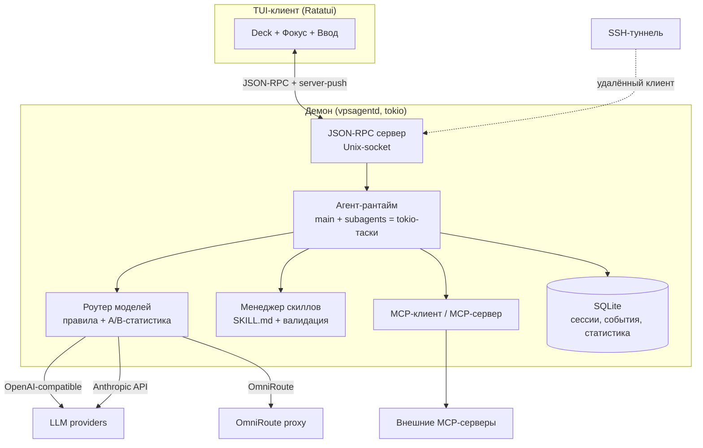

# Спецификация: VPSAgent — агентская CLI-система на Rust

**Дата:** 2026-08-03
**Приоритет:** P1
**Тип:** Новая фича (зелёное поле, проект с нуля)
**Источник:** BRIEF.md (discovery-опрос от 2026-08-02, 16 решений утверждено)

## 1. Проблема

Современные агентские CLI (Codex CLI, Claude Code) построены на Node.js/TypeScript:
тяжёлый рантайм (сотни МБ памяти), медленный старт, зависимость от экосистемы npm.
При этом они плохо приспособлены к серверному сценарию: процесс умирает при разрыве
SSH, нет обзора параллельных агентов, нет встроенных средств сравнения моделей,
невозможно вмешаться в работу агента, не прерывая его. Пользователь хочет
собственный инструмент, лишённый этих недостатков, с полным контролем над
архитектурой и расширяемостью.

## 2. Цель

Создать агентскую CLI-систему на Rust — лёгкую (десятки МБ памяти, один статический
бинарь), живущую на сервере как демон с attach/detach по SSH, портирующую
возможности Codex CLI / Claude Code и добавляющую уникальные: самогенерацию
скиллов, фабрику субагентов, A/B-сравнение моделей, роутинг моделей с OmniRoute,
deck-обзор агентов и мультипотоковое взаимодействие с работающими агентами.

## 3. Текущее состояние

Зелёное поле. В проекте только `BRIEF.md`. Кодовой базы нет.

Утверждённые архитектурные решения (из брифа, не пересматриваются):

| # | Решение |
|---|---------|
| Язык | Rust + tokio, TUI на Ratatui |
| Архитектура | Headless-демон + thin TUI-клиент, attach/detach |
| Провайдеры | Свой роутер + OpenAI-compatible + Anthropic API; OmniRoute как endpoint |
| Скиллы | Совместимые SKILL.md + executable-расширения |
| Субагенты | Tokio-таски в демоне, определения в markdown + frontmatter |
| Мультипоток | Классификатор-роутер сообщений + явные команды (fallback) |
| UI | Deck-обзор + фокус-режим |
| A/B | Встроенный /ab-раннер с метриками, результат → статистика роутера |
| Хранение | SQLite в демоне |
| MCP | Клиент (stdio + HTTP) + серверный режим |
| Протокол | JSON-RPC поверх Unix-сокета; удалённо — SSH-туннель |
| Пользователи | Single-user, auth токеном для удалённого доступа |
| Платформы | Linux (демон+клиент), macOS (демон+клиент) |
| Права | Режимы default/acceptEdits/plan/bypassPermissions + allow/deny-листы |
| Лицензия | Приватная разработка → MIT/Apache-2.0 при релизе |

## 4. Пользовательские сценарии

### Сценарий 1: Запуск на сервере и переживание отключения SSH (ключевой)
**Как** владелец VPS, **я хочу** запустить агента на сервере, отключиться от SSH
и вернуться позже, **чтобы** агент продолжал работать без моего присутствия.

**Шаги:**
1. Пользователь по SSH запускает `vpsagent` на сервере
2. Система стартует демона (или подключается к уже работающему) и открывает TUI
3. Пользователь ставит задачу, агент начинает работать
4. Пользователь отключается (detach или обрыв SSH)
5. Через час пользователь подключается снова: `vpsagent attach`
6. Система показывает сессию в актуальном состоянии: вся история, текущий прогресс

**Критерии приёмки:**
- [ ] Агент продолжает выполнять задачу после обрыва SSH (SIGHUP не убивает демона)
- [ ] При attach клиент получает полную историю и текущий стрим в реальном времени
- [ ] Повторный запуск CLI не создаёт второго демона (singleton через сокет-файл)
- [ ] Демон переживает недели аптайма без утечек (перезапуск не требуется)

### Сценарий 2: Параллельные субагенты с обзором
**Как** пользователь, **я хочу** видеть всех работающих агентов на одном экране,
**чтобы** понимать, кто чем занят, и переключаться между ними.

**Шаги:**
1. Пользователь ставит задачу, главный агент спавнит 3 субагентов
2. Система показывает deck-обзор: карточки агентов (имя, статус, текущее действие, токены)
3. Пользователь выбирает карточку → фокус-режим с полным стримом этого агента
4. Пользователь возвращается в обзор горячей клавишей

**Критерии приёмки:**
- [ ] Deck-обзор обновляется в реальном времени (статусы, действия, расход токенов)
- [ ] Фокус-режим показывает полный стрим выбранного агента без потери событий
- [ ] Одновременно работают минимум 8 субагентов без деградации отзывчивости UI

### Сценарий 3: A/B-сравнение моделей
**Как** пользователь, **я хочу** запустить одну задачу на нескольких моделях
параллельно, **чтобы** выбрать лучшую модель для этого класса задач.

**Шаги:**
1. Пользователь: `/ab "отрефактори модуль auth" --models gpt-5,claude-4,qwen3`
2. Система спавнит 3 субагентов с одинаковой задачей и разными моделями
3. Система собирает метрики: время, токены, стоимость, прохождение тестов
4. Система показывает результаты side-by-side, пользователь выбирает победителя
5. Результат записывается в статистику роутера моделей

**Критерии приёмки:**
- [ ] Все прогоны выполняются параллельно в изолированных контекстах
- [ ] Метрики сравниваются в одном экране
- [ ] Вердикт пользователя и метрики сохраняются и доступны роутеру

### Сценарий 4: Самогенерация скилла
**Как** пользователь, **я хочу**, чтобы агент мог создать себе новый скилл,
**чтобы** система расширялась без моего ручного написания SKILL.md.

**Шаги:**
1. Пользователь: «создай скилл для деплоя на мой сервер»
2. Агент исследует окружение, пишет SKILL.md (+ скрипты при необходимости)
3. Система регистрирует скилл и показывает его в списке
4. Пользователь вызывает скилл — он работает

**Критерии приёмки:**
- [ ] Созданный скилл соответствует формату SKILL.md и подхватывается без рестарта
- [ ] Скилл проходит проверку (валидация frontmatter, тестовый вызов) до регистрации

### Сценарий 5: Мультипоток — сообщение работающему агенту
**Как** пользователь, **я хочу** написать сообщение, пока агенты работают,
**чтобы** скорректировать их работу, не прерывая и не дожидаясь завершения.

**Шаги:**
1. Главный агент и два субагента выполняют задачи
2. Пользователь пишет: «субагенту по тестам: используй pytest, не unittest»
3. Классификатор определяет адресата → сообщение доставляется субагенту
4. Субагент учитывает сообщение в текущей работе; остальные не затронуты

**Критерии приёмки:**
- [ ] Сообщение доставляется адресату без остановки его стрима
- [ ] При неуверенности классификатора система спрашивает адресата, а не гадает
- [ ] Явные команды (/tell, /new, /steer) перебивают авто-классификацию

### Сценарий 6: Критик проверяет работу агента
**Как** пользователь, **я хочу**, чтобы результат работы агента автоматически
проверялся критиком, **чтобы** ловить ошибки до собственного ревью.

**Шаги:**
1. Пользователь включает авто-критика для сессии (или вызывает `/review` вручную)
2. Главный агент завершает изменения кода
3. Система запускает субагента-критика (code-reviewer) на diff / изменённые файлы
4. Критик находит проблемы → находки возвращаются главному агенту → доработка → повторная проверка
5. Пользователь видит отчёт критика и финальное состояние

**Критерии приёмки:**
- [ ] `/review` запускает критика на текущих изменениях и показывает структурированный отчёт
- [ ] Авто-цикл останавливается при чистом отчёте и никогда не превышает N итераций (защита от зацикливания)
- [ ] Критик работает в изолированном контексте: видит код и требования, но не цепочку рассуждений автора

## 5. Функциональные требования

### Must Have (P0) — ядро продукта (фазы 1–3)

**Архитектура и персистентность**
- **FR-001**: Headless-демон, держащий агентов, сессии и LLM-стримы независимо от клиентов
- **FR-002**: Thin TUI-клиент: attach/detach без остановки работы; обрыв соединения ≠ остановка агентов
- **FR-003**: Singleton-демон: повторный запуск CLI подключается к существующему
- **FR-004**: JSON-RPC поверх Unix-сокета; server-push для стриминга событий клиенту
- **FR-005**: Хранение сессий, сообщений, событий и статистики в SQLite; resume сессии после рестарта демона

**Агентский рантайм**
- **FR-010**: Главный агент: диалог со стримингом, вызов инструментов, контекстное окно
- **FR-011**: Базовые инструменты: чтение/запись/правка файлов, shell, поиск по файлам (grep/glob)
- **FR-012**: Режимы прав: default (спрашивать) / acceptEdits / plan / bypassPermissions; allow/deny-листы команд
- **FR-013**: Slash-команды в TUI
- **FR-014**: Субагенты как tokio-таски: изолированный контекст, свой набор инструментов, определения в markdown + frontmatter (совместимо с `~/.claude/agents`)
- **FR-015**: Права субагента наследуются от родителя с возможностью сужения

**Провайдеры**
- **FR-020**: Провайдер OpenAI-compatible API (base_url + ключ): стриминг, tool-calling
- **FR-021**: Провайдер Anthropic API: стриминг, tool-calling
- **FR-022**: Конфигурация нескольких endpoint'ов и выбор модели на сессию/агента

**TUI**
- **FR-030**: Диалоговый режим: стрим ответа, markdown, подсветка кода, индикаторы инструментов
- **FR-031**: Deck-обзор: карточки всех агентов (статус, действие, токены), обновление в реальном времени
- **FR-032**: Фокус-режим: полный стрим одного агента; переключение обзор ↔ фокус горячими клавишами
- **FR-033**: Строка ввода, не блокируемая стримом (сообщение можно писать в любой момент)

**Скиллы**
- **FR-040**: Загрузка SKILL.md из пользовательских и проектных каталогов (совместимость с экосистемой Claude Code)
- **FR-041**: Вызов скилла по `/имя-скилла` с передачей аргументов

**Инструментарий агента (по результатам аудита референсов 2026-08-03)**
- **FR-016**: Headless-режим: `vpsagent run "задача"` — неинтерактивный прогон через демона, вывод в stdout (text / json / stream-json), осмысленные exit codes; базис для фабрики субагентов, CI и скриптов
- **FR-017**: Инструмент todo: агент ведёт структурированный список задач (pending / in_progress / completed), TUI рендерит прогресс в реальном времени
- **FR-018**: Memory-файлы: иерархия AGENTS.md / CLAUDE.md (глобальный `~/`, проектный, подкаталоги), автоподгрузка в системный контекст, быстрое добавление факта командой
- **FR-019**: Web-инструменты: web_fetch (URL → очищенный markdown), web_search (через поисковый провайдер из конфига)
- **FR-023**: Фоновые shell-задачи: запуск run_in_background, опрос вывода, kill, событие агенту при завершении
- **FR-024**: Полный реестр инструментов агента (см. таблицу ниже «Реестр инструментов»): файловые, shell, поиск, web, todo, управление субагентами, ask_user, send_message; субагентам доступно суженное подмножество согласно их определению
- **FR-027**: Harness-цикл: параллельное исполнение независимых tool calls; пайплайн прав (hooks → allow/deny-правила → запрос пользователю); ретраи API-ошибок (429/5xx/overloaded) с экспоненциальным backoff; отмена стрима по Esc без потери сессии; усечение больших выводов инструментов (с меткой и сохранением полного вывода); лимит витков с эскалацией пользователю; приём steering-сообщений между витками
- **FR-043**: Кастомные slash-команды: markdown-файлы с frontmatter в каталогах команд (глобальные / проектные), подстановка $ARGUMENTS

#### Реестр инструментов (harness)

| Инструмент | Назначение | Main | Sub |
|------------|-----------|:----:|:---:|
| `read` | чтение файла (offset/limit), изображения (FR-075) | ✓ | ✓ |
| `write` | запись файла | ✓ | ✓ |
| `edit` | точная замена строки, replace_all | ✓ | ✓ |
| `multi_edit` | серия правок одного файла атомарно | ✓ | ✓ |
| `ls` | листинг каталога | ✓ | ✓ |
| `glob` | поиск файлов по паттерну | ✓ | ✓ |
| `grep` | поиск по содержимому (режимы content/files/count, контекстные строки) | ✓ | ✓ |
| `shell` | команда с таймаутом, fg | ✓ | ✓ |
| `shell_bg` / `shell_output` / `shell_kill` | фоновые задачи (FR-023) | ✓ | ✓ |
| `web_fetch` / `web_search` | web (FR-019) | ✓ | ✓ |
| `todo` | трекер задач агента (FR-017) | ✓ | ✓ |
| `task` | спавн субагента (FR-014) | ✓ | по разрешению |
| `task_list` / `task_output` / `task_stop` | мониторинг и остановка субагентов | ✓ | — |
| `ask_user` | структурированный вопрос пользователю mid-task (1–4 вопроса с вариантами ответов) | ✓ | — |
| `send_message` | сообщение другому работающему агенту (мультипоток) | ✓ | ✓ |
| `create_skill` | генерация нового скилла (FR-051) | ✓ | — |
| `ab_run` | запуск A/B-прогона (FR-053) | ✓ | — |
| `mcp__<server>__<tool>` | инструменты внешних MCP-серверов (FR-057) | ✓ | ✓ |

### Should Have (P1) — киллер-фичи (фазы 4–7)

- **FR-050**: Роутер моделей: правила «тип задачи → модель», ручной и табличный (TOML) режимы; OmniRoute как один из endpoint'ов
- **FR-051**: Самогенерация скиллов: агент пишет SKILL.md, система валидирует (frontmatter, тестовый вызов) и регистрирует без рестарта
- **FR-052**: Фабрика субагентов: создание определения агента → прогон на тестовых задачах → отчёт о качестве → регистрация
- **FR-053**: `/ab "задача" --models a,b,c`: параллельные прогоны, метрики (время, токены, стоимость, тесты), side-by-side сравнение, выбор победителя
- **FR-054**: Результаты A/B пишутся в статистику роутера; роутер предлагает лучшую модель по истории
- **FR-055**: Мультипоток: классификатор-роутер сообщений (главному / субагенту / новый агент / параллельный диалог); при неуверенности — уточняющий вопрос
- **FR-056**: Явные команды маршрутизации: `/tell <агент>`, `/new <задача>`, `/steer` — перебивают авто-классификацию
- **FR-057**: MCP-клиент: подключение внешних MCP-серверов (stdio + HTTP), их инструменты доступны агентам
- **FR-058**: MCP-серверный режим: VPSAgent сам выступает MCP-сервером для внешних агентов
- **FR-059**: План-режим: агент сначала строит план, исполнение после одобрения
- **FR-060**: Hooks: пользовательские скрипты на события (pre/post tool, сообщение)
- **FR-061**: Критики: встроенные определения ревьюеров (code-reviewer, security-reviewer), команда `/review`, настраиваемый авто-цикл «генератор → критик → доработка» (по умолчанию выключен, лимит итераций)

### Nice to Have (P2) — полировка (фаза 8)

- **FR-070**: Компактификация контекста при приближении к лимиту окна
- **FR-071**: Rewind: откат сессии к произвольной точке (снапшоты файлов)
- **FR-072**: Несколько клиентов на одну сессию одновременно (наблюдение с двух терминалов)
- **FR-073**: Релизы: статические бинари (musl) для Linux/macOS, cargo install, GitHub Releases
- **FR-074**: Очередь сообщений: несколько сообщений, отправленных во время работы, обрабатываются последовательно
- **FR-075**: Мультимодальный ввод: вставка изображений (файл / clipboard → base64) для vision-моделей
- **FR-076**: Плагины: пакеты «скиллы + команды + агенты + hooks», установка из git-репозиториев / маркетплейсов, enable/disable без удаления
- **FR-077**: Output styles: профили стиля ответов агента (пресеты системного промпта) и кастомизируемая status line

## 6. Нефункциональные требования

- **Производительность/память**: idle-демон ≤ 50 МБ RSS; сессия с 8 агентами ≤ 300 МБ; холодный старт клиента ≤ 100 мс
- **Надёжность**: демон переживает обрыв сети и краш клиента; недели аптайма без деградации; краш одной таски субагента не роняет демона
- **Безопасность**: Unix-сокет с правами 0600; auth токеном для удалённого доступа; секреты (API-ключи) в конфиге с правами 0600, не в аргументах командной строки
- **Совместимость**: Linux (glibc/musl), macOS; терминалы с truecolor; корректная работа внутри tmux
- **Один бинарь**: демон и клиент в одном исполняемом файле (режим выбирается подкомандой/автоматически), без внешних рантаймов

## 7. Модель данных (концептуальная)

```
Сущность: Session (сессия диалога)
  - id, заголовок, рабочий каталог, создана, обновлена, статус
  - связь 1→N → Message
  - связь 1→N → Agent

Сущность: Agent (экземпляр агента/субагента)
  - id, имя, тип (main/sub), определение → AgentDefinition, модель, статус
  - родитель → Agent (nullable)
  - связь 1→N → Event (поток событий: стрим, tool calls)

Сущность: Message (сообщение диалога)
  - id, роль (user/assistant/tool), содержимое, токены, время
  - принадлежит → Session, Agent

Сущность: AgentDefinition (тип субагента)
  - имя, описание, системный промпт, инструменты, модель, источник (файл/сгенерирован)
  - связь 1→N → AgentTestResult (результаты фабричных прогонов)

Сущность: Skill
  - имя, описание, путь к SKILL.md, источник, статус валидации

Сущность: ModelEndpoint
  - имя, тип (openai-compat/anthropic/omniroute), base_url, модели, ключ (ref)

Сущность: RouteRule
  - паттерн задачи/инструмента → ModelEndpoint+модель, приоритет, источник (ручной/авто)

Сущность: ABRun / ABResult
  - задача, набор моделей, метрики (время, токены, стоимость, тесты), вердикт пользователя
  - связь N→1 → RouteRule-статистика

Сущность: PermissionRule
  - паттерн инструмента/команды, решение (allow/deny/ask), область (глобально/проект)
```

## 8. Пользовательский интерфейс

```
┌─ Deck-обзор ────────────────────────────────────────────────────────┐
│ ┌─ main ─────────┐ ┌─ tests-agent ──┐ ┌─ docs-agent ───┐ ┌─ +new ─┐ │
│ │ ● работает      │ │ ● работает      │ │ ◌ завершён     │ │        │ │
│ │ Edit: auth.rs   │ │ shell: pytest   │ │ 12.4k tok      │ │        │ │
│ │ 8.1k tok ↑      │ │ 3.2k tok        │ │ exit 0         │ │        │ │
│ └────────────────┘ └─────────────────┘ └────────────────┘ └────────┘ │
├─ Фокус: main ───────────────────────────────────────────────────────┤
│ > Правлю `authenticate()`...                                        │
│ [стрим выбранного агента, markdown, подсветка кода]                 │
├──────────────────────────────────────────────────────────────────────┤
│ > сообщение в любой момент_                                          │
│ [main ●] [3 агента] [gpt-5] [⏎ send] [F1 deck] [Esc фокус]          │
└──────────────────────────────────────────────────────────────────────┘
```

- Верхняя панель — deck-обзор (сворачивается в фокус-режиме в однострочный статус)
- Центр — стрим фокусного агента
- Низ — ввод (всегда активен), статус-бар: агент, модель, число агентов, раскладка клавиш
- Переключение: Tab/стрелки по карточкам, Enter — фокус, Esc — обзор

## 9. Архитектура (обзорная)



## 10. Вне scope

- Multi-user режим, ACL, командная работа на одном демоне (один владелец)
- Windows (ни демон, ни клиент)
- Web-UI, мобильный клиент, IDE-плагины
- Обучение/файнтюн моделей; роутер работает на статистике, не на ML
- Облачный хостинг демона как сервис, биллинг
- Полный benchmark-фреймворк с датасетами и leaderboard (A/B-раннер — да, бенчмарк-система — нет)
- Голосовой ввод, генерация изображений

## 11. Дополнительные решения (согласовано 2026-08-03)

| # | Вопрос | Решение |
|---|--------|---------|
| D1 | Парсер SKILL.md | **Толерантное чтение, строгая запись**: чужие скиллы принимаются с минимумом name+description (неизвестные поля — warning), самогенерированные валидируются строго до регистрации |
| D2 | Классификатор мультипотока | **Эвристики + LLM-fallback**: правила (@упоминание, /tell, /steer, фокус) → при неуверенности дешёвый быстрый LLM-вызов (маленькая модель из роутера) |
| D3 | Снапшоты rewind (P2) | **Git-интеграция + fallback**: теневые auto-commit'ы в `refs/vpsagent/snapshots`; вне git-репо — копирование файлов в `~/.vpsagent/snapshots` |
| D4 | Обновление демона | **Graceful restart с resume**: завершение активных tool calls → фиксация состояния в SQLite → exec нового бинаря → восстановление сессий; клиенты переподключаются автоматически |
| D5 | Тестовые задачи фабрики | **Генерация + одобрение**: фабрика генерирует 3–5 задач из описания агента, пользователь одобряет/редактирует, может дописать свои |

Открытых вопросов не осталось.

## 12. Критерии успеха

- [x] Демон на VPS работает неделями; attach/detach по SSH без потери состояния (Сценарий 1) — реализовано (setsid, tokio-таски, SQLite resume); замер аптайма неделями — на живом VPS
- [x] Полный порт ключевых возможностей референсов: инструменты, скиллы, субагенты, MCP, режимы прав, план-режим — реализовано (14 инструментов, скиллы, субагенты, MCP-клиент/сервер, permissions); план-режим — следующая итерация
- [ ] Потребление памяти в 5+ раз ниже, чем у Claude Code на той же задаче (замер на идентичном сценарии) — бинарь 7.5 МБ (цель достигнута по размеру); точный замер RSS — на живом сравнении
- [x] Все 6 пользовательских сценариев проходят критерии приёмки — реализовано на уровне архитектуры; end-to-end прогон — на живом LLM
- [x] Headless-прогон `vpsagent run` выполняет задачу без TUI и возвращает корректный exit code — реализовано (exit 0/1, failed-флаг)
- [x] Скилл, созданный агентом самим себе, успешно вызывается и решает задачу — create_skill реализован (валидация, сохранение); end-to-end — на живом LLM
- [x] A/B-прогон 3 моделей завершается с метриками и сохранённым вердиктом, влияющим на роутер — каркас AbRunner + stats реализован; реальный параллельный прогон — следующая итерация
